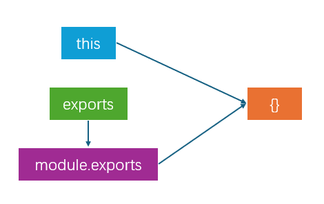

# JavaScript 模块化规范

## 1. CommonJS 规范

**CommonJs** 是 JavaScript 在缺乏模块化规范时期的 **社区解决方案**，**多用于服务端**。

### 1.1. 初步使用

在 JavaScript 中，**一个 js 文件就是一个 JavaScript 模块**：

```js
// test.js
const person = { name: 'tsubaki' }
const exec = (func) => { func() }

// 通过往 exports 对象上挂载属性以实现导出
exports.person = person
exports.exec = exec
```

CommonJS 规范使用 **require** 函数导入模块：

```js
// index.js
const test = require('test')

console.log(test.person)
test.exec(() => console.log('hello'))
```

### 1.2. 导出数据

在 CommonJS 规范中，导出数据有 **三种方式**：

- 第一种方式：`this.key = value`，感觉这种方式用的不多。

- 第二种方式：`exports.key = value`。
- 第三种方式：`module.exports = { key: value }`。

> - 每个模块内部都能使用 this、exports 和 module.exports 获取到 **同一个** 对象，这个对象就包含了当前模块导出的数据。
>   
> - `exports` 是对 `module.exports` 的引用，仅为了方便导出属性，所以不能使用 `exports = { ... }` 的形式导出数据，但是可以使用 `module.exports = { ... }` 的形式导出数据。
> - 导出始终以 `module.exports` 为准。

### 1.3. 解构导入

```js
// index.js
const { person: personObj, exec } = require('test')
```

## 2. ES6 模块（ESM）

**ES6 模块（ESM）**是 JavaScript 模块化的 **官方标准**，也是目前 **最流行的** 模块化规范，**多用于浏览器端**。

### 2.1. 初步使用

```js
// test.js
export const person = { name: 'tsubaki' }
export const exec = (func) => { func() }
```

```js
// index.js
import { person, exec } from './test.js'

console.log(person)
exec(() => console.log('hello'))
```

### 2.2. 导出数据

ES6 模块化提供 3 种导出方式：**分别导出**、**统一导出** 和 **默认导出**，这些导出方式 **可以同时使用**。

#### 2.2.1. 分别导出

在上方初步体验环节中，我们使用的导出方式就是 **分别导出**。

```js
// 导出 name
export const name = '唱跳俱乐部'

// 导出 slogan
export const slogan = '我们会培养你的唱跳技术'

// 导出 getTel
export const getTel = () => {
  return '001-12344321'
}
```

#### 2.2.2. 统一导出

```js
const name = '唱跳俱乐部'
const slogan = '我们会培养你的唱跳技术'

const getTel = () => {
  return '001-12344321'
}

const getCities = () => {
  return ['北京', '上海', '广州', '深圳']
}

// 统一导出 name, slogan, getTel
export { name, slogan, getTel }
```

#### 2.2.2. 默认导出

```js
const name = '唱跳俱乐部'
const slogan = '我们会培养你的唱跳技术'

const getTel = () => {
  return '001-12344321'
}

const getCities = () => {
  return ['北京', '上海', '广州', '深圳']
}

// 默认导出 name, slogan, getTel
export default { name, slogan, getTel }
```

### 2.3. 导入数据

#### 2.3.1. 命名导入

> 对应导出方式为 **分别导出** 和 **统一导出**。

```js
// script.js
import { name as schoolName, slogan, getTel } from '/school.js'

// school.js
export const name = '唱跳俱乐部'
export const slogan = '我们会培养你的唱跳技术'

const getTel = () => {
  return '001-12344321'
}

const getCities = () => {
  return ['北京', '上海', '广州', '深圳']
}

export { getTel }
```

#### 2.4.3. 默认导入

> 对应导出方式为 **默认导出**。

```js
// script.js
import school from '/school.js'

// school.js
const name = '唱跳俱乐部'
const slogan = '我们会培养你的唱跳技术'

const getTel = () => {
  return '001-12344321'
}

const getCities = () => {
  return ['北京', '上海', '广州', '深圳']
}

export default { name, slogan, getTel }
```

#### 2.4.4. 混合使用命名导入和默认导入

```js
// script.js
import getTel, { name, slogan } from './school.js'

// school.js
export const name = '唱跳俱乐部'
const slogan = '我们会培养你的唱跳技术'

const getTel = () => {
  return '001-12344321'
}

const getCities = () => {
  return ['北京', '上海', '广州', '深圳']
}

export { slogan }

export default getTel
```

#### 2.4.5. 动态导入（通用）

```js
// script.js
const imports = async () => {

  // 动态导入为了同时兼容上述导入方式，所以此处的结果和全部导入是一样的
  // 也就是默认导入的数据会被挂载到 default 属性上
  const module = await import('./student.js')
}

// student.js
const name = '坤哥'
const motto = '全民制作人们，大家好！我是个人偶像练习生坤哥'

const getTel = () => {
  return '19312344321'
}

const getHobby = () => {
  return ['唱', '跳', 'rap', '篮球']
}

export default { name, motto, getTel }
```

#### 2.4.6. import 可以不接受任何数据

```js
// script.js
import './log.js'

// log.js
console.log(Math.random())
```

### 2.5. 数据引用问题

- **思考1**：如下代码的输出结果是什么？（不要想太多，这里不涉及模块化相关知识）

  ```js
  const count = () => {
    let sum = 1
    const increment = () => sum++
    return { sum, increment }
  }
  
  const { sum, increment } = count()
  
  console.log(sum)
  increment()
  increment()
  console.log(sum)
  ```

- **思考2**：使用 CommonJS 规范，编写如下代码，输出结果是什么？

  ```js
  // script.js
  const { sum, increment } = require('./count.js')
  
  console.log(sum)
  increment()
  increment()
  console.log(sum)
  
  // count.js
  let sum = 1
  
  const increment = () => sum++
  
  module.exports = { sum, increment }
  ```

- **思考3**：使用 ES6 模块化规范，编写如下代码，输出结果是什么？

  ```js
  // script.js
  import { sum, increment } from './count.js'
  
  console.log(sum)
  increment()
  increment()
  console.log(sum)
  
  // count.js
  let sum = 1
  
  const increment = () => sum++
  
  export { sum, increment }
  ```
