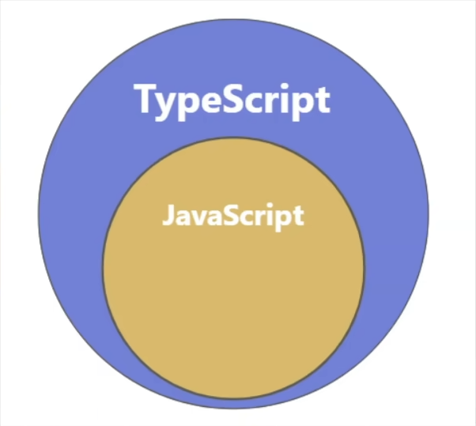
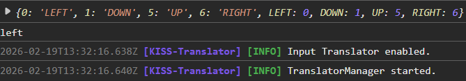
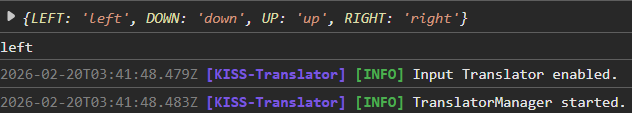
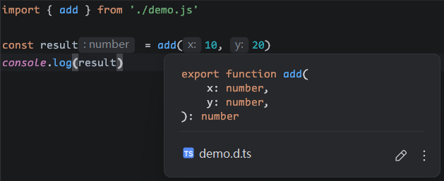

# TypeScript 快速上手

> 下文均使用 TS 指代 TypeScript，JS 指代 JavaScript（全称太长懒得打）

## 1. TypeScript 简介

- **TS** 由微软开发，是一门 **基于 JS 的扩展语言**。
  
- TS 增加了静态类型检查、接口、泛型等很多现代开发特性，因此更 **适合大型项目的开发**。
- **TS 需要编译为 JS**，然后交给浏览器或其它 JS 运行环境执行。

## 2. 为何需要 TypeScript

### 2.1. 今非昔比的 JavaScript

> 历史背景，了解即可。
>
> - JS 当年诞生时的定位是浏览器 **脚本语言**，用于在网页中嵌入一些简单的逻辑，而且代码量很少。
> - 随着时间的推移，JS 变得越来越流行，如今的 JS 已经可以全栈编程了。
> - 现如今的 JS **应用场景** 比当年 **丰富** 得多，代码量也比当年大很多，随便一个 JS 项目的代码量，可以轻松达到几万行，甚至几十万行！
> - 然而 JS 当年 “**出生简陋**”，没考虑到如今的应用场景和代码量，逐渐的就出现了 **很多坑**。

### 2.2. JavaScript 中的坑

#### 2.2.1. 不清不楚的数据类型

```js
const welcome = 'hello'

welcome() // 运行时才会爆出类型错误
```

#### 2.2.2. 有漏洞的逻辑

```js
const str = Date.now() % 2 ? '奇数' : '偶数'

if (str !== '奇数') {
  console.log('hello')
} else if (str === '偶数') { // 这块代码永远不会被执行
  console.log('world')
}
```

#### 2.2.3. 访问不存在的属性

```js
const message = 'hello world!'.toUperCase() // 运行时才会爆错
```

### 2.3. 静态类型检查

- 在代码运行前进行检查，发现代码的错误或不合理之处，减小运行时异常出现的概率，这种检查就叫 **静态类型检查**，TS 的核心就是静态类型检查，简而言之就是 **把运行时错误前置到编写时**。
- 同样的功能，TS 的代码量要 **大于** JS，但由于 TS 的代码结构更加清晰，在后期代码维护中 TS 要 **远胜于** JS。

## 3. 编译 TypeScript

### 3.1. 手动编译

> 要将 TS 编译为 JS，首先需要配置 TS 的编译环境，步骤如下。

- 创建一个 **script.ts** 文件，例如：
  ```ts
  // script.ts
  const person = {
    name: 'tsubaki',
    age: 22,
  }
  
  console.log(person.name, person.age)
  ```
  
- 全局安装 TS：`npm i -g typescript`
  
- 编译指定 `.ts` 文件：`tsc script.ts`，由于 tsc 是专门用于编译 TS 的，所以 .ts 后缀可写可不写

### 3.2. 自动编译

- 生成 TS 配置文件 **tsconfig.json**：`tsc --init`
  
- 监听目录中的 .ts 文件变化：`tsc --watch`，也可以指定监听的 .ts 文件，若不指定则默认监听所有 .ts 文件
  
- 配置编译出错时不生成 .js 文件（一点小优化）：`tsc --noEmitOnError --watch`，也可以通过修改 tsconfig.json 文件中的 noEmitOnError 配置实现

## 4. 类型声明

使用 `:` 来对变量、函数形参或函数返回值进行类型声明：

```ts
const sum = (x: number, y: number): number => x + y

const result: number = sum(10, 20)

console.log(result)
```

在 `:` 后也可以写 **字面量类型**，不过实际开发中用的不多：

```ts
const str: 'hello' = 'world' // 会爆错，因为限定了变量 str 只能存储 'hello'
```

## 5. 类型推断

TS 会根据我们的代码自动进行 **类型推导**，比如这里的变量 a，TS 将自动推导出其类型为 number：

```ts
let a = 10
a = true // TS2322: Type boolean is not assignable to type number
```

但要注意，类型推断不是万能的，对于基本类型而言类型推导足以胜任，但 **面对复杂类型时还是容易出岔子**，所以面对复杂类型时建议还是尽量明确的编写其类型声明。

## 6. 类型总览

### 6.1. JavaScript 中的数据类型

JS 中常用类型如下：

- string
- number
- boolean
- undefind
- bigint
- symbol
- object
- null

其中 object 包含：Array，Function，Date，Error 等等……

### 6.2. TypeScript 中的数据类型

TS 中常用类型如下：

- 上述所有 JS 类型
- any
- unknown
- never
- void
- tuple
- enum

还提供了两种自定义类型的方式：**type** 和 **interface**。

### 6.3. 基元类型与包装类型

> 在 JS 中的这些内置构造函数：Number、String、Boolean，它们用于创建对应的包装对象，在 **日常开发中很少使用**，在 TS 中也是同理，所以在 TS 中进行类型声明时，通常都是用其基元类型，就是小写的 string、number、boolean。

## 7. TypeScript 常用类型

### 7.1. any

any，代表 **任意**，一旦将变量类型声明为 any，那就意味着 **放弃了** 对该变量的类型检查。

```ts
let a: any // 明确声明 a 的类型为 any

a = 10
a = 'hello'
a = true

let b // 隐式声明 b 的类型为 any

b = 10
b = 'hello'
b = true

let c = 'hello' // 像这样声明的同时赋初值，变量类型就不会被推断为 any 了
```

**注意点**：any 类型的变量可以赋值给 **任意类型** 的变量。

```ts
let a: any // 明确声明 a 的类型为 any

const b: number = a // 不会爆错
const c: string = a
```

### 7.2. unknown

unknown，代表 **未知**，实际使用上像是安全版本的 any，适合在 **不确定数据的具体类型** 的场景下使用。

```ts
let a: unknown // 明确声明 a 的类型为 unknown

a = 10
a = 'hello'
a = true

const b: number = a // 与 any 的不同点就在于赋值给其他类型变量时会爆错

// 解决方式 1
if (typeof a === 'number') {
  const c: number = a
}

// 解决方式 2
const d: number = a as number

// 解决方式 3
const e: number = <number>a
```

**注意点**：读取 any 类型数据的任何属性都不会爆错，而 unknown 恰恰与之相反。

```ts
let a: any // 明确声明 a 的类型为 any

a.length // 不管是读取 length 属性还是当成函数调用都不会有任何错误
a()

let b: unknown // 明确声明 a 的类型为 any

b.length // TS2339: Property length does not exist on type unknown
b() // TS2349: This expression is not callable. Type {} has no call signatures.
```

### 7.3. never

never，代表 **绝对的无**，简而言之就是不能有任何值，**undefind、null、''、0** 都不行。

几乎不用 never 去限制变量类型，因为没有意义：

```ts
let a: never // 明确声明 a 的类型为 never

a = undefined //如下赋值都会爆错
a = null
a = ''
a = 0
```

never 一般是由 TS 主动推断出来的：

```ts
const a = 'hello'
if (typeof a === 'string') {
  console.log(a.toUpperCase())
} else {
  console.log(a) // TS 将会推断出 else 分支里的 a 的类型为 never
}
```

### 7.4. void

void 常用于 **函数返回值的类型声明**，代表函数不应该返回任何值，并且 **调用者也不应该对函数的返回值进行任何操作**。

```ts
const printf = (message: string): void => {
  console.log(message)
}

const result = printf('Hello World!') // 直到这一步为止，都不会有爆错

if (result) { // 这里爆错，原因就是调用者对一个 void 函数的返回值进行了操作，所以 void 限制的其实就是这个
  console.log(result)
}
```

> **注意**：由于 TS 是 JS 的超集，JS 里的一些特性在 TS 里也存在，比如 JS 里函数就算没有使用 return 返回任何值，也会隐式的返回一个 undefined，所以 void 其实并不能限制函数返回 undefined，它的语义更倾向于 **调用者不应对函数返回值做任何处理**。换句话说就是函数里可以使用 return 提前结束函数，但不能使用 return 返回一个值，就酱。

### 7.5. tuple

tuple 是一种特殊的 **数组类型**，可以存储 **固定数量** 的元素，并且每个元素的 **类型是已知的** 且 **可以不同**，常用于精确描述一组值的类型。

```ts
const arr1: [number, string] = [1, '2']
const arr2: [number, string?] = [1] // ? 代表可选
const arr3: [number, ...string[]] = [1, '2', '3', '4']
```

### 7.6. enum

> enum 常用于定义 **一组命名常量**，它能增强代码的 **可读性**，也能让代码 **更好维护**。

下述代码的功能是：根据调用 func 时传入的不同参数执行不同的逻辑。其存在的问题是给 func 传参时没有任何提示，编码者很容易写错参数，并且用于逻辑分支的 left、down、up 和 right 是 **一组相关的值**，那么此时就特别适合使用 **enum** 优化。

```ts
const func = (dir: string): void => {
  switch (dir) {
    case 'left': {
      console.log('left')
      break
    }
    case 'down': {
      console.log('down')
      break
    }
    case 'up': {
      console.log('up')
      break
    }
    case 'right': {
      console.log('right')
      break
    }
    default: {
      console.log('default')
      break
    }
  }
}

func('left')
```

#### 7.6.1. 数字枚举

数字枚举是一种最常见的枚举类型，其成员的值会 **自动递增**，且数字枚举还具备 **反向映射** 的特点，简单讲就是可以通过值获取对应的名称。

```ts
enum Direction {
  LEFT, // 值默认从 0 开始递增
  DOWN,
  UP = 5, //当然也能手动更改
  RIGHT,
}

console.log(Direction)

// 优化后
const func = (dir: Direction): void => {
  switch (dir) {
    case Direction.LEFT: {
      console.log('left')
      break
    }
    case Direction.DOWN: {
      console.log('down')
      break
    }
    case Direction.UP: {
      console.log('up')
      break
    }
    case Direction.RIGHT: {
      console.log('right')
      break
    }
    default: {
      console.log('default')
      break
    }
  }
}

func(Direction.LEFT)
```



#### 7.6.2. 字符串枚举

与数字枚举类似，区别在于其成员的值是字符串，由于 TS 无法自动为成员创建字符串类型的值，所以 **需要为每个成员手动赋值**，并且 **丢失了反向映射** 的特点。

```ts
enum Direction {
  LEFT = 'left', // 需要手动为所有成员赋值
  DOWN = 'down',
  UP = 'up',
  RIGHT = 'right',
}

console.log(Direction)

const func = (dir: Direction): void => {
  switch (dir) {
    case Direction.LEFT: {
      console.log('left')
      break
    }
    case Direction.DOWN: {
      console.log('down')
      break
    }
    case Direction.UP: {
      console.log('up')
      break
    }
    case Direction.RIGHT: {
      console.log('right')
      break
    }
    default: {
      console.log('default')
      break
    }
  }
}

func(Direction.LEFT)
```



#### 7.6.3. 常量枚举

常量枚举就是在普通枚举的定义前加上一个 **const** 关键字，其在编译时会被 **内联**，避免生成一些额外代码。简单讲就是，TS 在编译时会将枚举 **成员引用** 替换为 **实际值**，这可以减少生成的 JS 代码量，并提高运行时的性能。

这是普通枚举的 TS 代码和其生成的 JS 代码：

```ts
// script.ts
enum Direction {
  LEFT = 'left',
  DOWN = 'down',
  UP = 'up',
  RIGHT = 'right',
}

// script.js
var Direction;
(function (Direction) {
    Direction["LEFT"] = "left";
    Direction["DOWN"] = "down";
    Direction["UP"] = "up";
    Direction["RIGHT"] = "right";
})(Direction || (Direction = {}));
console.log(Direction.LEFT);
```

这是常量枚举的 TS 代码和其生成的 JS 代码：

```ts
// script.ts
const enum Direction {
  LEFT = 'left',
  DOWN = 'down',
  UP = 'up',
  RIGHT = 'right',
}

console.log(Direction.LEFT)

// script.js
console.log("left" /* Direction.LEFT */);
```

## 8. 自定义类型

type 可以 **为任意类型创建别名**，让代码更简洁、可读性更强，同时能更方便地进行类型复用和扩展。

### 8.1. 基本用法

> 类型别名使用 type 关键字定义，type 后跟类型名称，例如下述代码就使用 type 创建了 num 作为 number 的别名。

```ts
type num = number

const number: num= 100
```

### 8.2. 联合类型

> 联合类型是一种高级类型，它表示该类型的值可以是几种不同类型中的一种。

```ts
type Status = number | string
type Gender = '男' | '女'

const status1: Status = 404, status2: Status = '404'
const gender1: Gender = '男', gender2: Gender = '女', gender3: Gender = '未知' // gender3 的定义爆错，因为类型不匹配
```

### 8.3. 交叉类型

> 交叉类型允许将多个类型合并为一个类型。合并后的类型将拥有所有被合并类型的成员。交叉类型 **通常用于对象类型**，因为交叉简单类型的结果就是 never。

```ts
type Person = {
  name: string
}

type Player = Person & {
  level: number
}

const player: Player = {
  name: 'tsubaki',
  level: 1000
}
```

## 9. 类的基础知识

简单的类定义和继承：

```ts
// 父类
class Package {
  constructor(public weight: number) {
  }

  calculate(): number {
    return 0
  }

  getDetails(): string {
    return `包裹重量为 ${this.weight}kg，运费为 ${this.calculate()} 元`
  }
}

// 子类继承父类
class StandardPackage extends Package{
  constructor(weight: number, public price: number) {
    super(weight)
  }

  // 覆写父类方法
  override calculate(): number {
    return this.weight * this.price
  }
}

// 调用父类存在的方法
const details = new StandardPackage(10, 5).getDetails()
console.log(details)
```

## 10. 属性修饰符

| 修饰符    | 含义     | 具体规则                              |
| --------- | -------- | ------------------------------------- |
| public    | 公开的   | 可以被：**类内部、类外部、子类** 访问 |
| protected | 受保护的 | 可以被：**类内部、子类** 访问         |
| private   | 私有的   | 可以被：**类内部** 访问               |
| readonly  | 只读的   | **只读** 属性，**无法被修改**         |

## 11. 抽象类

> 概述：抽象类是一种 **无法被实例化** 的类，专门用来定义类的 **结构和行为**，类中可以书写 **抽象方法**，也可以写 **具体实现**。抽象类主要用来为其派生类提供一个 **基础结构**，要求其派生类 **必须实现** 其中的抽象方法。

```ts
// 定义抽象类
abstract class Package {
  protected constructor(public weight: number) {
  }

  // 抽象方法
  protected abstract calculate(): number

  // 具象方法
  getDetails(): string {
    return `包裹重量为 ${this.weight}kg，运费为 ${this.calculate()} 元`
  }
}

// 继承抽象类
class StandardPackage extends Package{
  constructor(weight: number, public price: number) {
    super(weight)
  }

  // 实现抽象方法
  override calculate(): number {
    return this.weight * this.price
  }
}

const details = new StandardPackage(10, 5).getDetails()
console.log(details)
```

> 总结：何时使用抽象类？
>
> - 定义 **通用模板**：为一组相关的类定义通用的行为（方法或属性）
> - 提供 **基础实现**：在抽象类中提供某些方法或为其提供基础实现，如此派生类就可以继承这些实现
> - 确保 **关键实现**：强制派生类实现一些关键行为
> - **共享逻辑** 或代码：当多个类需要共享部分逻辑或代码时，抽象类可以避免重复

## 12. 接口

> interface 是一种 **定义结构** 的方式，主要作用是为：类、对象、函数等规定 **一种格式**，这样可以确保代码的一致性和类型安全，但要注意 interface **只能定义格式**，**不能包含任何实现**！

### 12.1. 定义类的格式

```ts
interface IPerson {
  name: string,
  age: number,
  speak(message: string): void,
}

class Person implements IPerson {
  constructor(public name: string, public age: number) {
  }

  speak(message: string) {
    console.log(message, this.name, this.age)
  }
}

new Person('tsubaki', 22).speak('hello')
```

### 12.2. 定义对象的格式

```ts
interface IUser {
  name: string,
  readonly age: number,
  gender?: string,
  play: () => void,
  [key: string]: any, // 索引签名，表示可以添加任意符合其规则的属性，比如 phone: '19312344321'
}

const user: IUser = {
  name: 'tsubaki',
  age: 22,
  gender: '男',
  play: () => {
    console.log('haha')
  },
  phone: '19312344321',
}
```

### 12.3. 定义函数的格式

```ts
interface ICount {
  (x: number, y: number): number,
}

const count: ICount = (x, y) => x + y
```

### 12.4. 接口之间的继承

```ts
interface IPerson {
  name: string,
  age: number,
}

interface IStudent extends IPerson {
  grade: number,
}

const student: IStudent = {
  name: 'tsubaki',
  age: 22,
  grade: 4
}
```

### 12.5. 接口自动合并

```ts
interface IStudent {
  name: string,
  age: number,
}

interface IStudent {
  grade: number,
}

const student: IStudent = {
  name: 'tsubaki',
  age: 22,
  grade: 4
}
```

> 总结：何时使用接口？
>
> - **定义类的格式**：规定一个类需要实现哪些属性和方法
> - **定义对象的格式**：描述数据模型、API 相应格式、配置对象……等等，是开发中用的最多的场景
> - **定义函数的格式**：规定一个函数的参数和返回值
> - **扩展第三方类型**：在需要扩展第三方类型的场景下，接口的作用巨大

## 13. 泛型

> 泛型允许我们在定义函数、接口或类时能够使用类型参数来表示 **未指定的类型**，这些参数在具体 **使用时** 才被指定为 **具体的类型**，泛型能让同一段代码适用于多种类型，同时仍然保持类型的安全性。

下述代码中的 `<T>` 就是泛型（也不一定非得叫 T），设置泛型后即可在函数中使用 T 来表示该类型：

```ts
const log = <T>(data: T) => console.log(data)

log<number>(100) // 可以手动指定泛型
log('hello') // 也可以由 TS 自动推断

interface IPerson<T> {
  name: string,
  age: number,
  desc: T,
}

const p1: IPerson<string> = { // interface 则必须指定泛型，不然爆错
  name: 'tsubaki',
  age: 21,
  desc: '好人',
}

class Person<T> {
  constructor(public name: string, public age: number, public desc: T) {
  }
}

const p2 = new Person<number>('tsubaki', 21, 250) // class 可加可不加
const p3 = new Person('tsubaki', 21, '好人')
```

## 14. 类型声明文件

> 类型声明文件是 TS 中的一种特殊文件，通常以 `.d.ts` 作为文件后缀。它的主要作用是 **为现有 JS 代码提供类型信息**，使得 TS 能够在使用这些 JS 库时进行 **类型检查和提示**。

```js
// demo.js
export const add = (x, y) => x + y
```

```ts
// demo.d.ts
declare function add(x: number, y: number): number

export { add }
```

```ts
// script.ts
import { add } from './demo.js'

const result = add(10, 20)
console.log(result)
```

